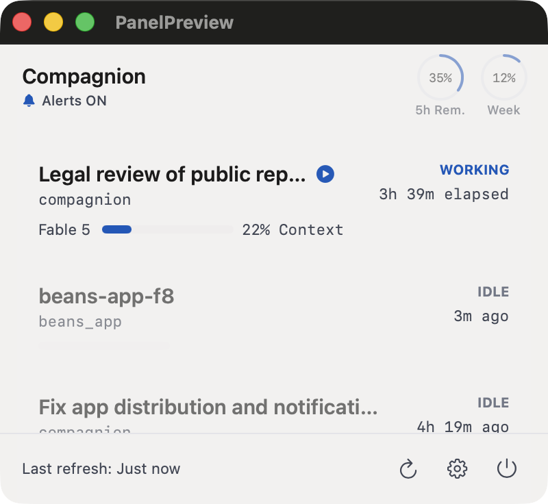

# Compagnion

> *Compagnon* in French, *companion* in English — this app lives somewhere
> in between.

A macOS menu-bar companion for [Claude Code](https://claude.com/claude-code):
see at a glance which of your sessions are working, idle, or waiting for your
input — and get pinged the moment one needs you.

<p align="center">
  
</p>

## Features

- **Menu-bar status** — one compact counter per state: `!` sessions waiting
  for you, `✱` working, moon idle. Template-rendered, so it stays legible on
  light and dark menu bars.
- **Native notifications** — a banner the moment a session needs permission,
  asks a question, finishes its turn, or hits an API error. Click to jump
  straight there.
- **Jump to the session** — click a card to focus the exact terminal tab or
  editor window the session lives in (Terminal, iTerm2, VS Code, Cursor…).
- **Context gauge & model** — each card shows the model the session runs and
  how full its context window is, amber past 70%, red past 90%.
- **Account usage** — your 5-hour and weekly rate-limit gauges, always
  visible in the panel header.
- **Remote approval** *(opt-in, off by default)* — when you're away from the
  terminal, Allow or Deny a permission request from the notification itself.
  Requires an unlocked Mac; every decision is written to a local audit log.

## Install

```sh
brew install --cask florentvotte/tap/compagnion
```

Or grab the DMG from [Releases](https://github.com/FlorentVotte/compagnion/releases)
and drag Compagnion into Applications. Both are universal, Developer ID
signed and notarized.

Then:

1. Launch Compagnion and click the `✱` menu-bar icon.
2. Open **Settings** (gear icon) → **Set up integration**. This adds hooks
   and a status-line forwarder to `~/.claude/settings.json` so events reach
   Compagnion instantly — a timestamped backup is written first, and the
   **Remove** button restores your previous settings exactly.
3. Optionally enable **Launch Compagnion at login**.

Without the integration, Compagnion still works by polling
`claude agents --json` — notifications and live gauges just need the hooks.

## Build from source

```sh
swift run            # quick start from the terminal
./make-app.sh        # or build a proper Compagnion.app bundle
```

## Privacy

Everything stays on your machine: Compagnion reads local Claude Code state
(`claude agents --json`, `~/.claude` transcripts and settings) and listens
only on `127.0.0.1`. It sends no telemetry and makes no network requests.

## Requirements

- macOS 14+
- Claude Code CLI installed (looked up in `~/.local/bin`, `~/.claude/local`,
  `/opt/homebrew/bin`, `/usr/local/bin`)

## License

[MIT](LICENSE).

Compagnion is an independent open-source project. It is not affiliated with,
endorsed by, or sponsored by Anthropic. Claude is a trademark of Anthropic,
PBC.
